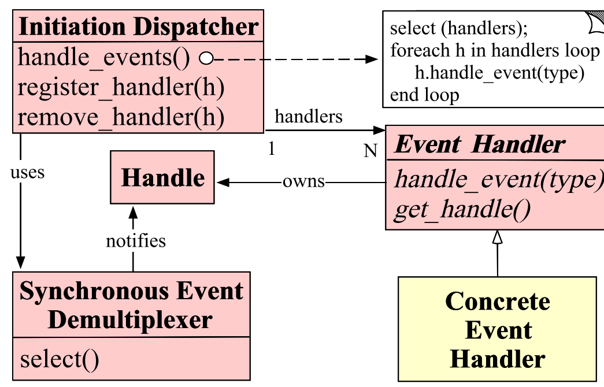

Reactor pattern implemented in C++, supporting select, poll, and epoll modes.

Reference:

[1] Schmidt D C. Reactor: an object behavioral pattern for demultiplexing and dispatching handles for synchronous events[C]//Proceedings of the First Pattern Languages of Programs Conference. 1994.

https://www.dre.vanderbilt.edu/~schmidt/PDF/reactor-siemens.pdf
